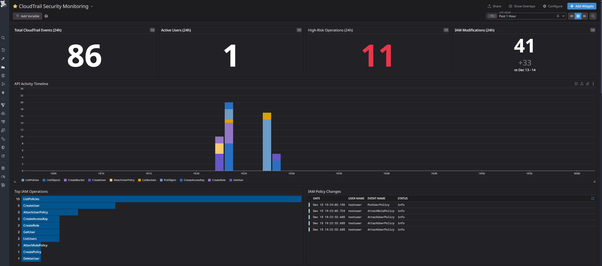
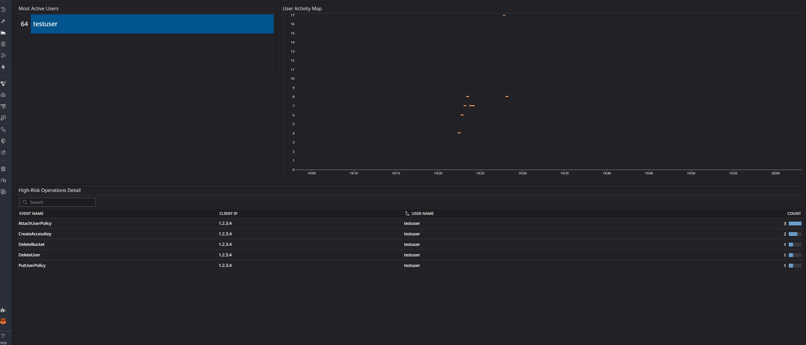
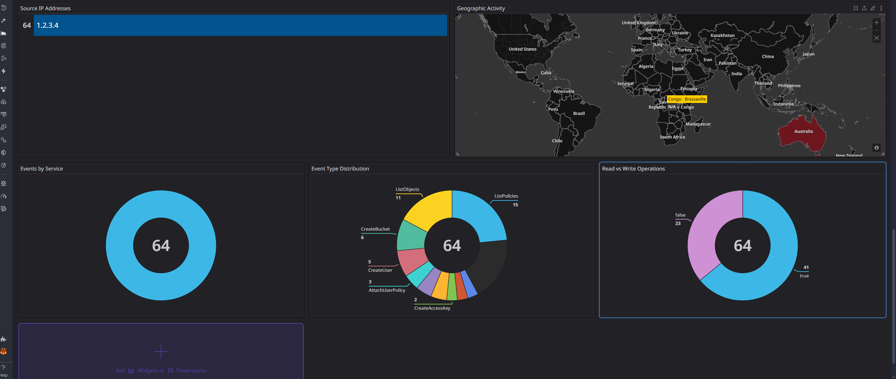

# CloudTrail Security Monitoring Dashboard


## 📊 Overview

A professional Security Operations Center (SOC) dashboard built in Datadog for real-time CloudTrail security monitoring and threat detection. This dashboard provides comprehensive visibility into AWS API activity, IAM security events, S3 operations, and user behavior analytics.

**Purpose:** Real-time detection of security threats including privilege escalation, unauthorized access, data exfiltration, and destructive operations.

**Built for:** Security analysts, cloud security engineers, and SOC teams monitoring AWS infrastructure.

---

## 🎯 Dashboard Capabilities

### Security Monitoring Features

✅ **IAM Security Analysis**

- Privilege escalation detection (policy attachments, role assumptions)
- Administrative access grants tracking
- User and role creation monitoring
- Policy modification auditing

✅ **S3 Data Security**

- Bucket access monitoring
- Deletion event tracking (buckets and objects)
- Upload/download activity analysis
- Public access detection potential

✅ **Threat Detection**

- High-risk operation identification
- Destructive activity tracking (deletions, policy changes)
- Access key creation monitoring
- Unusual activity pattern detection

✅ **User Behavior Analytics**

- Activity pattern analysis
- Geographic access tracking
- Anomalous behavior identification
- User activity heatmaps

✅ **Operational Intelligence**

- API activity trends over time
- Service usage distribution
- Read vs. write operation analysis
- Event type categorization

---

## 📸 Dashboard Walkthrough

### Section 1: Executive Summary & Timeline



#### Key Metrics Row (Top)

This section provides at-a-glance security health indicators:

- **Total CloudTrail Events (86)**: Overall API activity volume in the last 24 hours
- **Active Users (1)**: Number of unique users making API calls
- **High-Risk Operations (11)** ⚠️ **RED ALERT**: Critical security events detected
  - Policy attachments (privilege escalation)
  - Access key creation (credential generation)
  - Deletion operations (destructive actions)
  - Administrative access grants
- **IAM Modifications (41)**: Changes to identities and permissions

#### API Activity Timeline

Stacked bar chart showing:

- **Temporal patterns** of API activity
- **Event type distribution** over time (color-coded by operation)
- **Activity spikes** indicating unusual bursts
- **Service usage trends** across the timeline

**Security Use Cases:**

- Detect after-hours activity (off-peak spikes)
- Identify bulk operations (suspiciously high volumes)
- Correlate events during incident investigation
- Establish baseline activity patterns

---

### Section 2: IAM Security Monitoring

#### Top IAM Operations

Most frequent IAM-related API calls:

- **ListPolicies (15)**: Policy enumeration activity
- **CreateUser (5)**: New user account creation
- **AttachUserPolicy (3)**: Policy attachment events (privilege changes)
- **CreateAccessKey (2)**: New credential generation
- **CreateRole (2)**: Role creation activity

### IAM Policy Changes Table

Detailed audit trail of critical policy modifications:

- **Timestamp**: Exact time of each policy change
- **User Name**: Who performed the action
- **Event Name**: Type of operation (AttachUserPolicy, PutUserPolicy)
- **Status**: Success/failure indicator

**Security Value:**

- Track privilege escalation attempts
- Monitor administrative access grants
- Audit compliance with least privilege principle
- Investigate unauthorized permission changes

---

### Section 3: S3 Data Security & Deletions


### Top S3 Operations

Most common S3 API calls:

- **ListObjects (11)**: Bucket enumeration (potential reconnaissance)
- **CreateBucket (6)**: New bucket creation
- **ListBuckets (3)**: Account-wide bucket listing
- **PutObject (3)**: File uploads
- **HeadBucket (2)**: Bucket existence checks
- **DeleteBucket (1)**: Bucket deletion (destructive)
- **DeleteObject (1)**: Object deletion (data loss)

#### S3 Activity Distribution

Pie chart visualization showing:

- Percentage breakdown of S3 operations
- Most frequent activities (ListObjects at 40.7%)
- Balance between read/write/delete operations

**S3 Deletions (2)** ⚠️ **RED ALERT**

Critical metric tracking destructive operations:

- Immediate visibility into data deletion events
- Red color coding for high-priority alerts
- Includes both bucket and object deletions

**Security Use Cases:**

- Detect data exfiltration (excessive ListObjects/GetObject)
- Monitor unauthorized deletions
- Track bucket creation for shadow IT detection
- Identify reconnaissance activity patterns

---

### Section 4: User Activity & Threat Detection



#### Most Active Users

User activity ranking:

- **testuser (64 events)**: Primary account activity
- Identifies power users or potentially compromised accounts
- Baseline for anomaly detection

#### User Activity Heatmap

Time-series visualization showing:

- **Temporal activity patterns** by user
- **Peak activity periods** (darker colors = more events)
- **Baseline behavior** for anomaly detection
- **Off-hours activity** identification

#### High-Risk Operations Detail Table

Comprehensive audit log of security-critical events:

| Event Name | Client IP | User Name | Count |
|------------|-----------|-----------|-------|
| AttachUserPolicy | 1.2.3.4 | testuser | 3 |
| CreateAccessKey | 1.2.3.4 | testuser | 2 |
| DeleteBucket | 1.2.3.4 | testuser | 1 |
| DeleteUser | 1.2.3.4 | testuser | 1 |
| PutUserPolicy | 1.2.3.4 | testuser | 1 |

**Security Significance:**

⚠️ **Privilege Escalation**: AttachUserPolicy events indicate permission grants
⚠️ **Credential Creation**: CreateAccessKey generates new authentication keys
⚠️ **Destructive Operations**: Delete events represent data/resource loss
⚠️ **Inline Policies**: PutUserPolicy creates custom permissions

**Incident Response Value:**

- Immediate visibility into critical security events
- Source IP tracking for geolocation analysis
- User attribution for accountability
- Chronological ordering for timeline reconstruction

---

### Section 5: Network Intelligence & Analytics



#### Source IP Addresses

Traffic origin analysis:

- **1.2.3.4 (64 events)**: All activity from single IP
- Enables detection of:
  - Credential sharing (multiple users, one IP)
  - Compromised accounts (unusual IP for user)
  - Geographic anomalies (unexpected locations)

#### Geographic Activity Map

Global visualization showing:

- **Australia (highlighted in red)**: Primary activity location (Brisbane, Queensland)
- **Congo-Brazzaville (highlighted)**: Additional detected location
- Real-time geographic threat detection
- VPN/proxy usage identification

#### Events by Service

Service usage distribution:

- **S3 (100%)**: All activity focused on storage service
- Identifies service concentration
- Detects unusual service access patterns

#### Event Type Distribution

Granular operation breakdown:

- **ListObjects (11 events)**: Most common operation
- **ListPolicies (15 events)**: IAM enumeration
- **CreateBucket (6 events)**: Resource creation
- **CreateUser (5 events)**: Identity creation
- **AttachUserPolicy (3 events)**: Permission changes
- **CreateAccessKey (2 events)**: Credential generation

#### Read vs Write Operations

Security risk analysis:

- **True (41 events - 64%)**: Read-only operations (lower risk)
  - ListObjects, GetUser, ListPolicies
  - Information gathering activities
- **False (23 events - 36%)**: Write operations (higher risk)
  - CreateBucket, DeleteUser, AttachUserPolicy
  - State-changing, potentially destructive actions

**Security Insights:**

- Write operations carry higher security risk
- Excessive writes may indicate malicious activity
- Balance indicates normal operational behavior
- Shift toward writes triggers investigation

---

## 🔍 Security Use Cases

### 1. Privilege Escalation Detection

**Scenario:** Attacker gains initial access and attempts to escalate privileges

**Dashboard Detection:**

- **High-Risk Operations (RED)** widget spikes
- **IAM Policy Changes** table shows AttachUserPolicy events
- **High-Risk Operations Detail** reveals AdministratorAccess grant
- **Timeline** shows temporal clustering of privilege changes

**Response Actions:**

1. Check user legitimacy in IAM Policy Changes table
2. Verify source IP in High-Risk Operations Detail
3. Review geographic location on map
4. Correlate with User Activity Heatmap for baseline deviation

---

### 2. Data Exfiltration Monitoring

**Scenario:** Insider or compromised account downloading sensitive data

**Dashboard Detection:**

- **S3 Operations** shows spike in ListObjects/GetObject
- **Most Active Users** identifies abnormal user activity
- **S3 Activity Distribution** shows imbalance toward read operations
- **User Activity Heatmap** reveals off-hours access

**Response Actions:**

1. Identify affected buckets in S3 Operations
2. Check user pattern in Activity Heatmap (baseline deviation)
3. Verify source IP and geographic location
4. Review Read vs Write Operations for unusual ratio

---

### 3. Unauthorized Deletion Detection

**Scenario:** Malicious actor or misconfiguration causes data deletion

**Dashboard Detection:**

- **S3 Deletions (RED)** widget triggers alert
- **High-Risk Operations Detail** shows DeleteBucket/DeleteObject
- **Timeline** reveals when deletions occurred
- **Event Type Distribution** highlights deletion proportion

**Response Actions:**

1. Immediate alert from S3 Deletions widget (red = priority)
2. Identify who deleted what in High-Risk Operations table
3. Check source IP and geographic location
4. Timeline correlation for incident reconstruction

---

### 4. Insider Threat Identification

**Scenario:** Trusted employee abuses access for malicious purposes

**Dashboard Detection:**

- **User Activity Heatmap** shows unusual timing patterns
- **Most Active Users** reveals abnormally high activity
- **High-Risk Operations** accumulate from single user
- **Geographic Activity** shows VPN or unexpected location

**Response Actions:**

1. Baseline deviation in Activity Heatmap (off-hours, weekends)
2. Cross-reference with High-Risk Operations Detail
3. Geographic anomaly detection (unusual country/city)
4. Volume analysis (excessive API calls)

---

### 5. Reconnaissance Detection

**Scenario:** Attacker enumerates environment before attack

**Dashboard Detection:**

- **IAM Operations** spike in ListPolicies, ListUsers, ListRoles
- **S3 Operations** shows excessive ListBuckets, ListObjects
- **Timeline** reveals burst pattern of enumeration
- **Event Type Distribution** weighted toward list operations

**Response Actions:**

1. Identify enumeration patterns in Top IAM/S3 Operations
2. Check if user has legitimate reason for broad access
3. Correlate with Geographic Activity for suspicious locations
4. Timeline analysis for automated/scripted behavior

---

## 🎓 How to Use This Dashboard

### For Daily Monitoring

**Morning Security Briefing (5 minutes):**

1. Check **High-Risk Operations** widget - should be 0 or low
2. Review **S3 Deletions** - should be 0 unless planned
3. Scan **IAM Policy Changes** table for unexpected entries
4. Verify **Geographic Activity** matches expected locations

### For Incident Investigation

**Step-by-Step Investigation Workflow:**

1. **Identify Alert Source**
   - Which widget triggered? (High-Risk, Deletions, etc.)
   - What metric is abnormal?

2. **Gather Context**
   - **Who**: Check user in High-Risk Operations Detail
   - **What**: Review specific operations in event tables
   - **When**: Timeline analysis for temporal patterns
   - **Where**: Source IP and Geographic Activity map

3. **Establish Baseline**
   - Compare with User Activity Heatmap
   - Check historical patterns in Timeline
   - Review typical activity in Most Active Users

4. **Correlate Events**
   - Cross-reference across multiple widgets
   - Look for clustered activity in Timeline
   - Check if multiple high-risk ops from same user/IP

5. **Determine Impact**
   - Review Read vs Write Operations balance
   - Check Event Type Distribution
   - Assess deletion counts

### For Compliance Auditing

**Audit Reporting:**

- **IAM Policy Changes**: Complete audit trail of permission modifications
- **High-Risk Operations Detail**: Evidence of security-critical events
- **User Activity Heatmap**: Access pattern documentation
- **Geographic Activity**: Location-based compliance verification

---

## 🛠️ Technical Implementation

### Architecture

```text
┌─────────────────────────────────────────────────────────┐
│                  LocalStack (AWS Emulator)              │
│  ┌───────────────────────────────────────────────────┐  │
│  │  CloudTrail Events                                │  │
│  │  • IAM API calls                                  │  │
│  │  • S3 API calls                                   │  │
│  │  • User identity tracking                         │  │
│  │  • Request parameters                             │  │
│  └───────────────────────────────────────────────────┘  │
└─────────────────────┬───────────────────────────────────┘
                      │
                      ↓ (boto3 CloudTrail API)
┌─────────────────────────────────────────────────────────┐
│         Python Forwarder Script                         │
│  • Polls CloudTrail every 10 seconds                    │
│  • Formats events as structured JSON                    │
│  • Deduplicates events                                  │
│  • Filters out monitoring noise                         │
└─────────────────────┬───────────────────────────────────┘
                      │
                      ↓ (HTTPS - Datadog Log API)
┌─────────────────────────────────────────────────────────┐
│              Datadog Cloud SIEM                         │
│  ┌───────────────────────────────────────────────────┐  │
│  │  CloudTrail Pipeline                              │  │
│  │  • Parses JSON structure                          │  │
│  │  • Extracts attributes (evt.name, usr.name, etc.) │  │
│  │  • Creates facets for filtering                   │  │
│  │  • Indexes for search                             │  │
│  └───────────────────────────────────────────────────┘  │
│                                                         │
│  ┌───────────────────────────────────────────────────┐  │
│  │  Security Dashboard (18 Widgets)                  │  │
│  │  • Real-time visualization                        │  │
│  │  • Custom queries and aggregations                │  │
│  │  • Alert thresholds                               │  │
│  └───────────────────────────────────────────────────┘  │
└─────────────────────────────────────────────────────────┘
```

### Data Flow

1. **Event Generation**: AWS API calls in LocalStack generate CloudTrail events
2. **Event Collection**: Python script polls CloudTrail API every 10 seconds
3. **Event Processing**: Script formats events with structured attributes
4. **Event Forwarding**: HTTPS POST to Datadog Log Intake API
5. **Event Parsing**: Datadog CloudTrail pipeline extracts attributes
6. **Event Storage**: Logs indexed with facets for querying
7. **Visualization**: Dashboard queries aggregated data in real-time

### Key Technologies

- **LocalStack Pro**: AWS service emulation with CloudTrail support
- **Python 3**: Event forwarding automation with boto3
- **Datadog Cloud SIEM**: Enterprise log aggregation and visualization
- **CloudTrail API**: AWS audit log interface
- **Docker**: Container orchestration for LocalStack

### Dashboard Specifications

- **Total Widgets**: 18
- **Visualization Types**: Query Value (7), Timeseries (1), Top List (5), Table (2), Pie Chart (3), Heatmap (1), Geomap (1)
- **Query Complexity**: Multi-field aggregations with nested JSON parsing
- **Refresh Rate**: Real-time (30-60 second intervals)
- **Data Retention**: Based on Datadog plan (15+ days)

---

## 📋 Widget Inventory

| # | Widget Name | Type | Purpose | Alert |
|---|-------------|------|---------|-------|
| 1 | Total CloudTrail Events | Query Value | Overall activity volume | - |
| 2 | Active Users | Query Value | Unique user count | - |
| 3 | High-Risk Operations | Query Value | Critical security events | Red if > 0 |
| 4 | IAM Modifications | Query Value | Permission changes | Yellow if > 5 |
| 5 | API Activity Timeline | Timeseries | Temporal patterns | - |
| 6 | Top IAM Operations | Top List | Most frequent IAM calls | - |
| 7 | IAM Policy Changes | Table | Detailed policy modifications | - |
| 8 | Top S3 Operations | Top List | Most frequent S3 calls | - |
| 9 | S3 Activity Distribution | Pie Chart | S3 operation breakdown | - |
| 10 | S3 Deletions | Query Value | Destructive operations | Red if > 0 |
| 11 | Most Active Users | Top List | User activity ranking | - |
| 12 | User Activity Heatmap | Heatmap | Temporal user patterns | - |
| 13 | High-Risk Operations Detail | Table | Comprehensive threat log | - |
| 14 | Source IP Addresses | Top List | Network origin tracking | - |
| 15 | Geographic Activity | Geomap | Global access visualization | - |
| 16 | Events by Service | Pie Chart | Service usage distribution | - |
| 17 | Event Type Distribution | Pie Chart | Operation categorization | - |
| 18 | Read vs Write Operations | Pie Chart | Risk-based segmentation | - |

---

## 🔐 Security Insights & Metrics

### Current Environment Analysis (From Screenshots)

**Overall Activity Profile:**

- **Total Events**: 86 API calls in 24 hours
- **Active Users**: 1 (testuser)
- **Primary Service**: S3 (100% of activity)
- **Geographic Source**: Australia (Brisbane, Queensland)
- **Source IP**: 1.2.3.4 (all activity)

**Security Posture:**

⚠️ **HIGH-RISK ALERTS (11 events)**

- 3× AttachUserPolicy (privilege escalation)
- 2× CreateAccessKey (credential generation)
- 1× DeleteBucket (destructive operation)
- 1× DeleteUser (account deletion)
- 1× PutUserPolicy (inline policy creation)

✅ **POSITIVE INDICATORS**

- Single source IP (no credential sharing)
- Consistent geographic location
- Balanced read/write ratio (64% read, 36% write)

⚠️ **AREAS FOR INVESTIGATION**

- All activity from Root user (no IAM user segregation)
- Administrative policy attachments detected
- Deletion operations occurred (data loss risk)
- Access key creation (potential lateral movement)

**Operational Metrics:**

- **IAM Modifications**: 41 events (high volume)
- **S3 Deletions**: 2 events (requires review)
- **Read Operations**: 41 (informational gathering)
- **Write Operations**: 23 (state changes)

---

## 🎯 Best Practices Demonstrated

### Dashboard Design

✅ **Visual Hierarchy**: Critical metrics at top, details below
✅ **Color Coding**: Red for alerts, green for normal, yellow for warnings
✅ **Actionable Alerts**: Clear thresholds trigger investigation
✅ **Contextual Data**: Multiple perspectives on same events
✅ **Drill-Down Capability**: Summary → Detail → Raw logs

### Security Operations

✅ **Defense in Depth**: Multiple detection mechanisms
✅ **Real-Time Monitoring**: Immediate alert capability
✅ **Audit Trail**: Comprehensive logging of all events
✅ **User Attribution**: Every action tied to identity
✅ **Geographic Tracking**: Location-based threat detection

### SIEM Implementation

✅ **Structured Logging**: JSON-formatted events with attributes
✅ **Attribute Extraction**: CloudTrail pipeline parsing
✅ **Faceted Search**: Indexed fields for filtering
✅ **Correlation**: Cross-widget event relationships
✅ **Retention**: Historical analysis capability

---

## 📚 Skills Demonstrated

### Cloud Security

- AWS CloudTrail log analysis
- IAM security monitoring
- S3 data protection
- Privilege escalation detection
- Threat hunting methodologies

### SIEM Engineering

- Datadog dashboard design
- Log pipeline configuration
- Query optimization
- Visualization best practices
- Alert threshold tuning

### DevOps & Automation

- Python scripting (boto3)
- API integration
- Docker containerization
- Event-driven architecture
- CI/CD for security monitoring

### Security Analysis

- Incident investigation workflows
- Baseline behavior establishment
- Anomaly detection
- Threat modeling
- Security event correlation

---

## 🚀 Future Enhancements

### Planned Improvements

**Detection Rules:**

- [ ] Automated alerting for privilege escalation
- [ ] Anomalous access pattern detection
- [ ] Failed authentication monitoring
- [ ] Compliance violation detection

**Advanced Analytics:**

- [ ] Machine learning for anomaly detection
- [ ] Predictive threat modeling
- [ ] User behavior analytics (UBA)
- [ ] Entity relationship mapping

**Integration Expansion:**

- [ ] Slack/PagerDuty alert integration
- [ ] JIRA ticket auto-creation
- [ ] AWS Security Hub correlation
- [ ] SOAR platform integration

**Dashboard Enhancements:**

- [ ] Template variables for filtering
- [ ] Custom time range comparisons
- [ ] Saved views for different personas
- [ ] Export/PDF reporting capability

---

## 📖 How to Recreate This Dashboard

### Prerequisites

- LocalStack Pro (Student/Ultimate tier)
- Datadog account (Free trial or Student plan)
- Docker Desktop
- Python 3.x with boto3, requests

### Setup Steps

1. **Clone the repository**

   ```bash
   git clone https://github.com/CMDemps/localstack-security-lab.git
   cd localstack-security-lab
   ```

2. **Start LocalStack**

   ```bash
   localstack start -d
   ```

3. **Configure environment**

   ```bash
   export DD_API_KEY='your-datadog-api-key'
   export DD_SITE='us5.datadoghq.com'
   ```

4. **Start CloudTrail forwarder**

   ```bash
   python3 scripts/cloudtrail-to-datadog.py
   ```

5. **Generate test data**

   ```bash
   ./scripts/generate-dashboard-test-data.sh
   ```

6. **Import dashboard**
   - Go to Datadog → Dashboards → New Dashboard
   - Follow the layout guide in `/docs/datadog-dashboard-layout-guide.md`
   - Or import JSON configuration (if provided)

7. **Wait 1-2 minutes** for events to populate

**Complete setup documentation**: [`/docs/cloudtrail-datadog-integration.md`](../docs/cloudtrail-datadog-integration.md)

---

## 📞 Contact & Portfolio

**Author**: Clayton Demps  
**GitHub**: [@CMDemps](https://github.com/CMDemps)  
**Project Repository**: [localstack-security-lab](https://github.com/CMDemps/localstack-security-lab)

**For Recruiters & Hiring Managers:**

This dashboard demonstrates practical experience with:

- ✅ Enterprise SIEM platforms (Datadog)
- ✅ AWS CloudTrail security analysis
- ✅ Real-time threat detection
- ✅ Security operations workflows
- ✅ Python automation for security
- ✅ Dashboard design and visualization

---

## 📄 License

This project is open source and available under the [MIT License](../LICENSE).

---

## 🙏 Acknowledgments

- **LocalStack Team**: AWS emulation platform
- **Datadog**: Cloud SIEM and monitoring platform
- **AWS**: CloudTrail specification and best practices
- **Security Community**: Threat detection methodologies

---

**⭐ If this dashboard helps you understand cloud security monitoring, please star the repository!**

---

*Last Updated: December 15, 2025*  
*Dashboard Version: 1.0*  
*LocalStack Version: Pro 4.0+*  
*Datadog Agent: Cloud-based intake*
